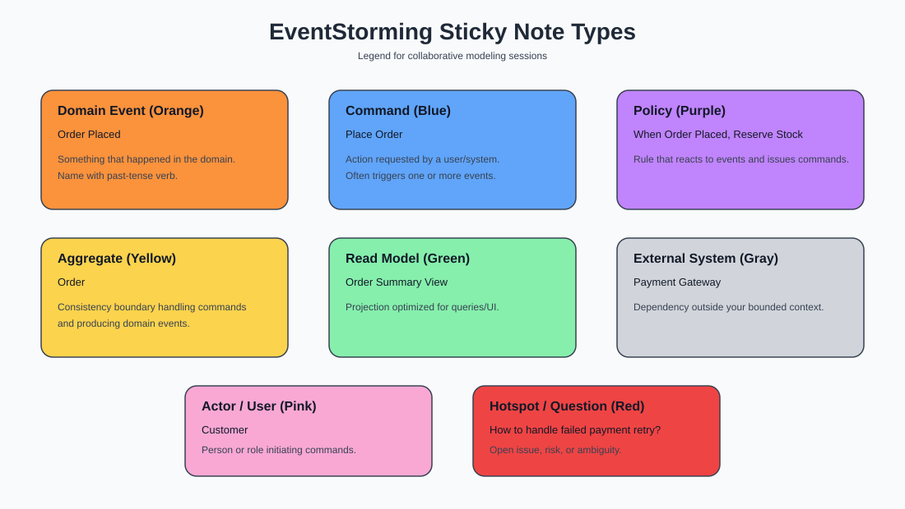
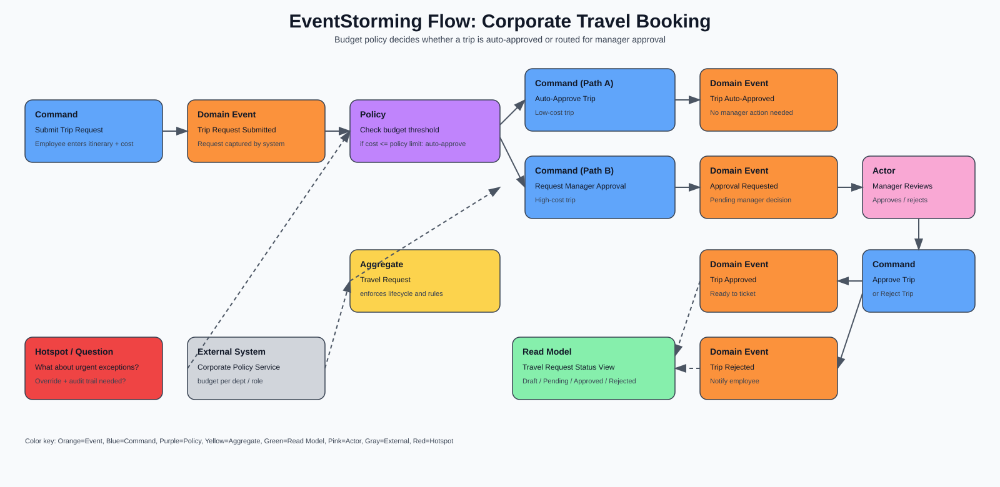

# Architecture for Flow

Susanne Kaiser

## Business Strategy with Wardley Mapping

A Wardley Map visualises the landscape in which an organisation operates.

### The Strategy Cycle

1. **Purpose**  - Why are we doing what we are doing?
2. **Landscape** - A description of the environment the organisation operates in
3. **Climate** - The external forces which the organisation cannot control
4. **Doctrine** - Universal principles which can be applied regardless of context
5. **Leadership** - Making context-specific decisions based on the above

By following this cycle an organisation can optimise mean time to respond (MTTR).

An organisation's vision comes from its purpose and core values.

### The Wardley Map

Decide the scope you want to map. You can start small, with just one user or user need. 

Start by describing the **value chain**. At the top are the users, and below that their needs. This is the problem space. Below that come the components which fufil the user needs, and then their dependencies. These are the solution space. 

The users and their needs are the 'anchor' of the map.

Components can be activities, practices, data, knowledge. Their position on the y-axis depends on how visible they are to the users. The components the user interfaces with most directly are at the top, these provide the most value to the user.

The components are then plotted on the x-axis according to it's **stage of evolution**. The stages of evolution are:
* Genesis - uncertain market, novel practices, focus on exploration
* Custom built - A forming market, emerging practices, focus on learning
* Product (including rental) - A growing market, good practices in place, focus on refining
* Commodity (including utilities) - A mature market, best practices in place, focus on efficiency

Components on the left change more than those on the right.

A map where the deeper a dependency is, the further to the right it is describes a system which is balanced and stable. Building mature components on top of volatile ones is risky.

Custom built components further down the chain which are not core to the organisation or exist as commodities may represent an effeiciency gap. But this is not necessarily true - see domain-driven design.

### Understanding Climactic Patterns

* Market forces like supply and demand tend to make components evolve towards the left and become commoditised.
* As components evolve their characteristics change, from volatile and uncertain towards stable and ordered.
* As components become commoditised they enable innovation because new emergent and custom components can be built on them.
* These higher-order systems create new sources of value.
* Competitors' actions will change the environment.
* Past success may breed inertia which impedes the evolution of components and undermines the organisation.

Assessing climactic patterns helps to reveal points of potential evolution.            

### Applying doctrinal principles

* **Know your users** - it's essential to understand this
* **Focus on user needs** - fulfilling these needs is why your business exists
* **Know the details** - understand what components are required to fill user needs
* **Challenge assumptions** - share the map as a group and question it
* **Use a common language** - using a ubiquittous language enables people with different roles to communicate effectively
* **Focus on high situational awareness** - Understand the landscape, this is where a map can help

* **Use appropriate methods per evolution stage** - agile/xp at genesis and custom, lean at product/rental, six sigma at commodity/utility.
* **Think small** - try to break a large landscape into small components that don't cross evolution stages (apply BDD)
* **Think small teams** - the two-pizza rule
* **Provide purpose, mastery and autonomy** - this provides motivation
* **Consider aptitude and attitude** - when building teams think not just about the skillset of individuals but also the mindset
* **There is no one culture** - this will change with evolutionary stage
* **Optimise flow** - the performance of a system is determined by its constraints (see, The Goal)
* **Design for constant evolution** - Adapting to change should not require constant reorganisation

## Exploring the problem space with Strategic Domain-Driven Design and Wardley Mapping

The core concept of DDD is that to build better software its design must align with the business domain. DDD helps us understand the problem domain before trying to develop the technical solution.

### Subdomains in DDD

#### The core domain
The essential, business-critical part of an organisation's problem domain. This usually provides most value to users and differentiates the organisation. In Wardley terms solutions for this subdomain will normally be at the genesis or custom-built stage of evolution. But as the domain matures it can evolve towards product or commodity, and the organisation will increasingly find advantage in cost rather than in differentiation.

#### The supporting subdomain
The supporting subdomain does not provide a competitive advantage and often exists in most similar products and services. It is simpler, non-differentiating, and simpler. If highly customisable or open source solutions are available it may reside at the product stage, but if more specialisation is needed then it becomes custom built, but should not demand high levels of investment.

#### The generic subdomain
The generic subdomain is uniquitous across many business systems, provide no competitive or differentiating advantage and are not specialised. Solutions for this domain should generally be product or commodity.

### Build or buy decisions with subdomain types and evolution stages

Wardley mapping suggests building custom software for the genesis and custom-built stages, buying for the product stage and outsourcing commodity to utility suppliers.

DDD points toward building for the core domain, buying for the generic domain and the decision for the supporting domain depending on the level of specialisation required.

The difference is that making the decision for a component based purely on the evolutionary stage risks overlooking the degree of business criticality. Over-customising off-the-shelf software brings more risk than may be worth it, even effecrive loss of vendor support. One alternative may be to use productised software only as designed and develop custom software for unsupported use cases - i.e. build and buy.

Evolution stages are about market maturity and user perception rather than who makes them. You could indicate buy versus built on a Wardley map using colours. This helps you assess your choices:

* Are we custom-building components that do not belong to the core domain?
* Does the level of specialisation justify a custom solution for supporting domains?

## Designing the solution space with strategic DDD

* The domain model expresses the domain logic and business rules relevant to that area of the system.
* Domain models are expressed in ubiquitous language which reflected a shared understanding within a bounded context.
* A domain model cannot exist without a boundary - the bounded context

### The different kinds of boundaries

* A linguistic and semantic boundary - the space in which things mean the same
* An ownership boundary - something only one team maintains
* A physical boundary  - something which can be implemented as separate solutions with its own artifacts

Architectural styles and business logic can vary from bounded context to context.

### Designing domain models and bounded contexts

An essential part of DDD is the collaboration between domain experts and software developers. By discussing user needs and intended outcomes we can start to derive the domain models and bounded contexts. A variety of techniques are available to help with this.

### EventStorming

EventStorming is a technique for exploring a domain using colour coded sticky notes. There are three formats.

#### Big Picture EventStorming

Identify **events** that have happened in the business domain along a timeline using orange sticky notes - e.g. 'order placed' - 'order shipped'. The most significant events are highlighted as being *pivotal*.

Humam **actors** are placed on yellow notes next to the relevant events. They could be an individual, a group, a persona, a role. External **systems** like another subdomain are placed on pink sticky notes.

Where participants encunter issues, questions, conflicts or risks they can be added on reddish notes as **hotspots**.

Sequences assigned to given actors are stacked using swimlanes.

#### Process modelling EventStorming

Process modelling zooms in on a particular part of the business domain and focuses on designing a process.

**Commands** are added as blue notes. These are instructions issued by actors or policies which are intended to cause domain events to happen, but they could be rejected. 

**Policies** are added as purple notes. They describe how a system is supposed to react when an event happens. 

**Read models** are added as green notes. They represent the state of the system at that moment in time and can be the result of a domain event.

#### Software design EventStorming

Software design EventStorming enables collaborative design of an event-driven software system. Here **aggregates** are introduced which represent consistent business rules. They receive commands and emit events. 

A policy or an actor retreiving information from a read model can issue a command. Commands can be invoked on aggregates or external systems. Aggregates and external systems generate domain events which in turn can translate into read models and policies.

### Domain storytelling

Domain storytelling is another collaborative technique to explore a problem domain. It focuses on telling a domain story from a particular actor's perspective.The actor can be a specific person, a group of people, or a system. It identifies which actors respond to which events and are required to perform which activities on a work object - documents, messages etc.

### Example mapping
Example mapping provides a structured way to refine the acceptance criteria of user stories. For a given story acceptance critera are captured on blue cards and then illustrated with examples on green cards. For example the acceptance criteria 'Only files in .docx format must be accepted' could be fleshed out with example like 'supplied file is a .docx and is accepted', 'supplied file is a .pdf and is rejected'. A question might arise like 'should we accept a legacy .doc file'? and that can be recorded on a pink note.

### User story mapping
Story mapping involves describing a user journey across a horizontal axis with key activities at the top. Below each activity step user stories are added, with the most valuable/fundamental at the top and enriching iterations below. Horizontal lines are drawn to identify viable releases.

## Bounded contexts and architectural styles
Bounded contexts do not dictate a particular architectural style. Key decisions to make are:

* **Monolith or distributed?** If the entire system shares similar architectural characteristics then a monoilth style may be suggested where everything deploys as a unit. Where characterisric differ then a distributed system of independently deployable components may be more appropriate.
* **Where should data live?** Should data be stored in one database or store, or in multiple? 
* **How should services communicate?** Synchronously or asynchronously?

Architecture should evolve as systems grow. Some principles from the book _Continuous Architecture in Practice_ are:
* Architect products - rather than projects
* Focus on quality attributes - let performance, scalability, security etc drive decisions
* Delay design decisions until they are absolutely necessary - avoid premature optimisation and overengineering
* Architect for change - favour small, loosely coupled components
* Architect for build, test, deploy, operate - early implementation, fast feedback loops
* Model the organisation of your teams after the design of the system - reverse Conway

Decisions can be recorded as ADRs.

## Bounded contexts and evolution stages
Bounded contexts can be mapped to their related evolution stage in a Wardley map. Core domains ought to be towards the left, suporting domains to the right of that, likely requiring custom development but with minimal investment. Generic subdomains ought to go in the product/commodity stage to the right.

## High cohesion and loose coupling
"A structure is stable if the cohesion is strong and the coupling is low". 

Within a bounded context we should have high cohesion, which is achieved when related behaviour sits in one place. When a behavious change is needed, only one context needs changing.

Where different contexts or modules depend on each other the coupling should be loose, so that they are easy to change. Where coupling is tight then changes also become coupled. This is more important for rapidly changing core domains than highly stable generic ones.

## Context maps
Context maps make change coupling explicit and visible. They consist of descriptive patterns which express different types of relationship. 

**Separate Ways (SW)**. When bounded contexts have no connections to others. In this case no coordination is required, and duplicating functionality may be less expensive than trying to integrate or collaborate.

**Published Language (PL)** A standardised and well documented shared interchange language. The format is published using schemas which implement standards.

**Anticorruption Layer (ACL)** Translates an external upstream model into an internal downstream model, protecting it from foreign concepts or frequent upstream changes.

**Conformist (CF)** The downstream model attached to the upstream model without further transformation. This simplifies integration but increases coupling. Suitable for use when conforming to a stable, well-designed upstream model which it is pointless for the downstream model to alter.

**Open-Host Service (OHS)** Not tailored to a specific client, the OHS exposes a convenient protocol to consumers via a public API.

**Customer Supplier (CS)** The downstream system acts as a customer to the upstream one, specifying needs for upstream to meet. 

**Shared Kernel (SK)** Two or more systems share a subset of threir domain model as a shared artifact or database. Change requires both teams to synchronise, coupling is tight. Desirable when the cost of integrating changes separately is higher than the cost of coordination.

**Partnership (PS)** Teams collaborate to achieve an aligned common goal. This requires a lot of coordination.

**Big Ball of Mud (BBoM)** No clear boundaries and a messy model. Architectural principles either never employed or forgotten.

Context maps can help show implicit dependencies where the relationship between A and B implictly affects C.

Context maps are technology agnostic, they apply whether the communication style is request-response or event-driven, synchronous blocking or asynchronous non-blocking. 

## Change coupling to core domains

Core domains usually change frequently and loose coupling is essential.

* Enable the upstream core to involve independently - avoid exposing the core domain model, use an OHS to provide an external API
* Protect downstream core from upstream models - an ACL protects business critical systems
* Avoid conforming to a volatile core - unless there is backward compatibilty
* Minimise duplication of complex core behaviour - employing SW would require expensive duplication of functionality which requires frequent updates, and this duplication weakens cohesion
* Minimise competing changes to the core influenced by other teams - customer-supplier relationships mean that downstream systems gain influence over the priorites of the supplier core teams and can lead to competing change requests. If the customer cannot accept changes them the evolution of the core domain becomes blocked.
* Minimise high communication bandwidth with other teams - if the volatile core domain is involved in partnerships then the coordination cost inhibits development of the domain

## Implementing the domain model with tactical DDD

The building blocks of domain-driven models:

* **Entity:** An object with its own life cycle which can change state over time by mutating values. An entity is defined by it's own unique id.
* **Value object:** An immutble object which does not declare its own identity, though it may contain the entity for a different type, like an entity object.
* **Aggregate:** A graph of closely related objects consisting of one or more entities and optionally one of more value objects. One aggregate instance reflects the state of one part of the domain model. The parent entity that composes all other parts of the aggregate is known as the aggregate root and this defines the public interface.
* **Domain service:** A domain service performs domain specific business logic which is not the responsibility of any one entitu or value object.
* **Domain event:** A domain event indicates something significant has occurred in a domain model. It's common for an aggregate to be the source of the event. One or more bounded contexts may be interested in the event.

See [explainer](tactical-dd-hexagonal.md) and [code example](tactical-dd-hexagon-code.md)
