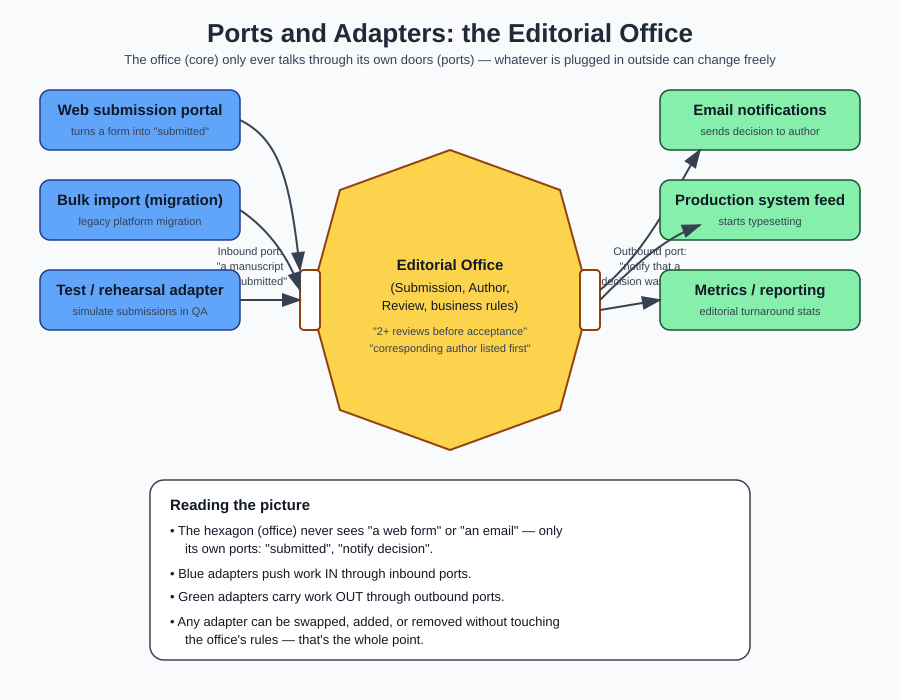

# An explainer for Ch4, implenting tactical DDD.

What do we mean by entities, value objects etc? Here is an example, using our own world of academic journal submissions.

## The building blocks, explained with a submission

Imagine a manuscript being submitted to a journal, sent out for peer review, and eventually accepted or rejected. That single, familiar process contains examples of every tactical DDD building block.

### Entity

An entity is something with its own identity and life cycle - it can change over time, but it's still "the same thing".

**Example: a Submission**

A submission has a unique ID (e.g. manuscript number `MS-2024-00812`). Over its life it moves through many states - `Submitted` → `Under Review` → `Revisions Requested` → `Accepted` - and details like the title or author list might even be edited along the way. Despite all these changes, it's still recognised as *the same submission* because of its ID, not because of what its fields currently contain.

### Value object

A value object has no identity of its own - it's defined entirely by its attributes. Two value objects with the same attributes are considered identical and interchangeable, and they're immutable (you don't edit one, you replace it with a new one).

**Example: an Author's name and affiliation**

`"Jane Smith, University of Bristol"` doesn't have an ID - if two submissions both list this exact name and affiliation, they're the same value. If Jane Smith moves institution, we don't "edit" the affiliation in place - we replace it with a new value object: `"Jane Smith, University of Oxford"`.

Other examples: a **DOI**, a **word count**, a **date of submission** - all defined purely by their value, not by an identity we track over time.

### Aggregate

An aggregate is a cluster of related objects - entities and/or value objects - that must be kept consistent together. It has one entity acting as the **aggregate root**, which is the only way the outside world is allowed to interact with the group. This protects the business rules that apply across the whole cluster.

**Example: the Submission aggregate**

The `Submission` entity is the aggregate root. It contains:
- A list of `Author` value objects (name, affiliation, order in author list)
- The manuscript file reference
- The current `Review` entities attached to it (each review has its own identity, reviewer, recommendation, and comments)

Business rules that only make sense at this level are enforced through the root - for example, "a submission cannot be marked as `Accepted` until at least two reviews have been submitted" or "the corresponding author must always be listed first". You're not allowed to reach in and directly change a `Review` without going through the `Submission` - this keeps the whole cluster consistent.

### Domain service

Sometimes a piece of business logic doesn't naturally belong to any single entity or value object - it's about coordinating between things.

**Example: an Editor Assignment service**

Deciding which editor should be assigned to a new submission might depend on the manuscript's subject area, current editor workloads, and conflict-of-interest checks against the author list. This logic doesn't obviously belong to the `Submission` itself, nor to an `Editor` - so it lives in a dedicated domain service, e.g. `EditorAssignmentService`, which takes a submission and returns the chosen editor.

### Domain event

A domain event records that something significant has happened - something other parts of the system (or other teams) might care about and want to react to.

**Example: `SubmissionAccepted`**

When an editor makes a final decision, a `SubmissionAccepted` event is raised. Other parts of the business might react to this single event in very different ways:
- The production team is notified to begin typesetting
- The author is emailed the decision
- A metric is updated for editorial turnaround-time reporting

The event itself is just a simple record of what happened (submission ID, date, decision) - it's up to interested parts of the system to decide how to respond.

## Why this matters (even if you don't write code)

These building blocks are a way of making sure the software's structure matches how we actually talk about our business - a submission, an author, a review, a decision - rather than becoming a tangle of database tables and functions that only engineers can decode. When a product colleague and an engineer both understand what a "submission aggregate" is and what rules it protects, conversations about new features or edge cases become much easier.

## Ports and adapters: keeping the rules separate from the outside world

The book's other big idea in this chapter is an architectural style for *where you put* all the entities, aggregates and rules we just described, so they stay protected from the messy outside world - whatever it happens to be built from that year. The book calls this **hexagonal architecture**, or **ports and adapters**. It's a simple idea buried under a lot of Java in the text, so let's use our own example instead.

### The editorial office analogy

Picture the domain model - `Submission`, `Author`, `Review`, and all the rules that go with them - as an **editorial office**. This office is strict about its rules ("a decision can't be made with fewer than two reviews", "the corresponding author is always listed first"), but it doesn't care *how* work arrives at its door, or *how* its outputs get delivered once a decision is made.

The office only ever communicates through a small, fixed set of **doors it defines itself** - in its own language. These doors are called **ports**:
- An inbound port: *"tell me a manuscript was submitted"*
- An outbound port: *"notify someone that a decision was made"*

Whatever is plugged into those doors from the outside is called an **adapter**. Adapters translate between the office's own language and whatever technology happens to be on the outside:

- A **web submission portal** adapter turns a form on our website into "a manuscript was submitted"
- A **bulk import** adapter could feed in manuscripts migrated from a legacy platform, through the exact same door
- A **test/rehearsal** adapter lets QA simulate submissions without a real website at all
- An **email** adapter turns "notify someone a decision was made" into an actual email to the author
- A **production system feed** adapter turns that same notification into a trigger for typesetting
- A **metrics** adapter turns it into a data point for editorial turnaround-time reporting

### Why the office never changes

The critical point: none of those adapters are known to the office itself. If we switch email providers, add a Slack notification, or replace our submission portal with a new vendor platform, we only build or swap an adapter - the office's rules about reviews and decisions are never touched, and don't need re-testing.

### Why this matters for non-engineers

- **It reframes scope conversations.** "Can we also notify authors via Slack?" should only ever mean *add a new adapter* - if an engineer tells you it requires touching core decision-making logic, that's a sign something has gone architecturally wrong, not that the request is unreasonable.
- **It explains why some things can be tested quickly.** The rules inside the office (e.g. "reject acceptance with fewer than two reviews") can be tested using a fake, rehearsal adapter, without needing a live website, database, or email system - which is why some changes can be verified faster than others.
- **It gives us a shared vocabulary for technical debt.** If changing the submission form on our website somehow requires changes to how decisions get emailed, that's a genuine, explainable structural problem - the boundary between the office and the outside world has leaked - rather than just "engineers being slow".

If you want to try working through a code example simpler than the one in the book, try [code example](tactical-dd-hexagon-code.md).